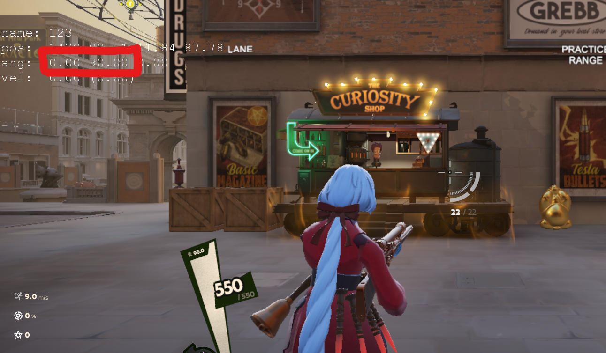

<h1 align="center">
      deadlock-esp
</h1>

> [!Important]
> НЕ РАБОТАЕТ!!!<br>
> ОБНОВЛЕНИЙ НЕ БУДЕТ

<!--

> [!WARNING]
> The use of cheat programs is strictly prohibited by Gaben. This may result in your account being banned!<br>
> If you care about your account, then do not use any cheats, including this one

Report your problem: https://github.com/Loara228/deadlock-esp/issues/new<br>
Offset changes: https://github.com/Loara228/deadlock-esp/issues/18
> Some things won't work without updating the offsets yourself <br>
> Некоторые вещи не будут работать без самостоятельного обновления смещений

## How to use

0. Install [Rust](https://www.rust-lang.org/ru/learn/get-started) and [Cargo](https://doc.rust-lang.org/cargo/getting-started/installation.html)
1. Clone repository
1. Change the program name in the [toml file](https://github.com/Loara228/deadlock-esp/blob/master/Cargo.toml)

```txt 
name = "{example}"
```

> [!NOTE]
> If desired, you can disable the console

```rs
#![cfg_attr(not(debug_assertions), windows_subsystem = "windows")]
```

3. Compile it:

```txt
cargo build --release
```

4. Start the game
5. Run the cheat

```txt
./{example}
```

6. To open and close the overlay, use the <kbd>HOME</kbd> key
7. If you have problems with the overlay, then try to run it like this

```txt
./{example} --old-window
```

8. Calibrate as shown in the picture



<hr>
-->


<details>
<summary>Функционал</summary>

+ Аимбот
   - Цели
      - Игроки
         - Голова / Шея / Грудь / Таз
      - Души, крипы
      - Выбор приоритета
   - Учитывает скорость цели
   - Контроль отдачи (RCS)
   - Настраиваемый FOV
      - Дистанция
      - Цвет
   - Настрока для максимальной дистанции
+ Радар
   - Маштаб
   - Цвета
   - Размер, позиция
   - Направления игроков
   - Иконки игрока
+ ESP игроков
   - Боксы (прямоугольник игрока)
      - Тип обводки
         - Обычный
         - Закругленный
         - Углы
      - Обводка
      - Тень обводки
      - Настройка цветов и тени обводки
   - Голова
   - Шкала здоровья игрока (healthbar)
      - Иконки
      - Настройки цвета
      - Динамеческое изменение ширины
   - Надписи
      - Отображание:
         - Здоровье
         - Название героя
         - Дистанция в метрах
      - Расположение
      - Контрастность
      - Размер шрифта
+ Offscreen
   - Здоровье
   - Дистанция
   - Иконка
+ Файл конфигурации
   - Сохранение / Загрузка
+ Список наблюдателей
   - Показывает кто за вами смотрит
   - Показывает кто еще смотрит с вами
+ Локализация
   - Русский
   - Китайский
   - Английский (Hamburger edition)
+ Скрипты
   - Shiv - Скрипт для ульты. (Работает только с квикастами). Отображает низкий порог здоровья и приминяет ульт. (работает криво)
   - Vindicta - Скрипт для ульты. Быстый выстрел.
   - Active Reload - Скрипт для прожатия перезарядки в нужный момент, работает когда есть предмет "Активная перезарядка"
   - Переключение приоритета entity - При нажатии на <kbd>F5</kbd> меняет приоритет для наведения. Крипы / Души
   - RadarToggle - При зажатии клавиши <kbd>ALT</kbd>, на радаре отображаются иконки героев (как в доте)
   - Movement - При зажатии клавиши <kbd>CTRL</kbd>, с небольшим ускорением, герой прыгает в подкате, чтобы сохранить скорость. <kbd>G</kbd> - Dash

</details>

## Прочие мелочи
   - Цикл оверлея не работает, когда окно игры не активно
   - Не используется WriteProcessMemory
   - События мыши отсылаются из другого процесса
   - Авто обновление указателей из памяти модуля игры

## Как добавить свой скрипт

Вы можете использовать этот интерфейс для создания своего скрипта. 

Функция **update** служит для написания логики нашего кода. Она принимает внешние данные игры, текущее состояние клавиши и настройки конфигурации. 

Функция **draw** отвечает за отрисовку на экране и вывод уведомлений. 

Метод **hero_id** возвращает идентификатор героя, для которого будет выполняться скрипт. Если указать значение _Hero::None_, то скрипт будет работать для всех героев. 

Для указания клавиши, которая будет использоваться при выполнении скрипта, предусмотрен метод **init_key_code**. Этот метод вызывается только при инициализации скрипта, и его значение нельзя изменить во время работы программы. Если ваш скрипт не требует нажатия клавиши, то следует вернуть значение _None_. Клавиша указывается как целое число (i32), однако для удобства можно воспользоваться VirtualKeys.<br>

```rs
#[derive(Default)]
pub struct MyScript {...}
impl HeroScript for MyScript {
    fn update(&mut self, game_data: &External, script_key: KeyState, settings: &mut Settings) {...}
    fn draw(&mut self, g: &egui::Painter, game_data: &External, toasts: &mut Toasts) {...}
    fn hero_id(&self) { Hero::Vindicta }
    // Название, которое будет отображаться в UI
    fn name(&self) -> &str {"My script!"}
     // Клавиша. Если клавиша не нужна, то возвращаем None
    fn init_key_code(&self) -> Option<i32> { Some(VirtualKeys::KEY_F1 as i32) }
}
```

Далее переходим в конструктор оверлея и добавляем свой скрипт

> src>external>scripts>mid.rs>get_scripts() -> Vec<(Arc<Mutex<dyn HeroScript>>, HeroScriptSettings)>

```rs
pub fn get_scripts() -> Vec<(Arc<Mutex<dyn HeroScript>>, HeroScriptSettings)> {
    vec![
        (Arc::new(Mutex::new(MyScript::default())), HeroScriptSettings::default())
    ]
}
```

<hr>

<!-- ## Offsets

<div align="left">
<b>
      <a href="https://github.com/Loara228/deadlock-esp/blob/master/offsets/client_dll.cs">cs💜</a> | 
      <a href="https://github.com/Loara228/deadlock-esp/blob/master/offsets/client_dll.hpp">cpp💀</a> | 
      <a href="https://github.com/Loara228/deadlock-esp/blob/master/offsets/client_dll.rs">rs🦀</a>
      (больше не обновляю)
</b>
</div>

Актуальные смещения, которые используются в проекте - [тык](https://github.com/Loara228/deadlock-esp/blob/master/src/external/offsets/mod.rs) -->

## Превью


<div align = "center">

</div>

<a href="https://www.youtube.com/watch?v=3nJs6GPmEZs"><sub><sub>💪старый бог💪</sup></sub></a>

