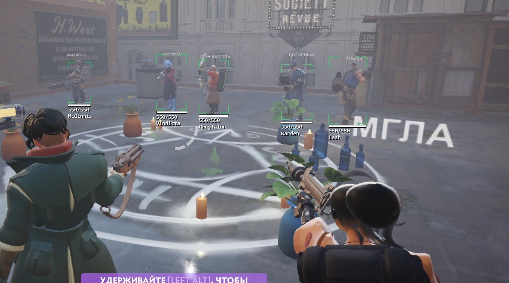
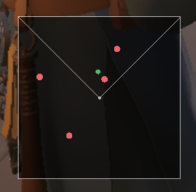
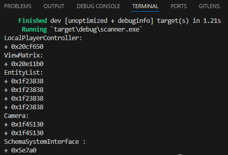

# external esp overlay

> [!WARNING]
> ВАЖНО: Текущий репозиторий будет полностью переписан, а старый будет размещен в другой ветке

> [!WARNING]
> IMPORTANT: The current repository will be completely rewritten, and the old one will be moved to a different branch

**Star this repository so you don’t lose it.**

## Offsets and status

- [offsets](https://github.com/Loara228/deadlock-esp/blob/old/deadlock/Dump/client_dll.cs): ~~20.09.2024~~
- [C++ format](https://github.com/Loara228/deadlock-esp/blob/old/deadlock/Dump/client_dll.hpp)
- undetected: **yes**

## Как запустить

1. Запустите игру
2. Запустите программу

## Как обновить

Если хотите обновить самостоятельно, то используйте это.

1. Найдите указатели по сигнатурам [тут](https://github.com/Loara228/deadlock-esp/blob/master/scanner/src/main.rs).

2. Замените указатели [в этом файле](https://github.com/Loara228/deadlock-esp/blob/master/deadlock/Offsets.cs).

