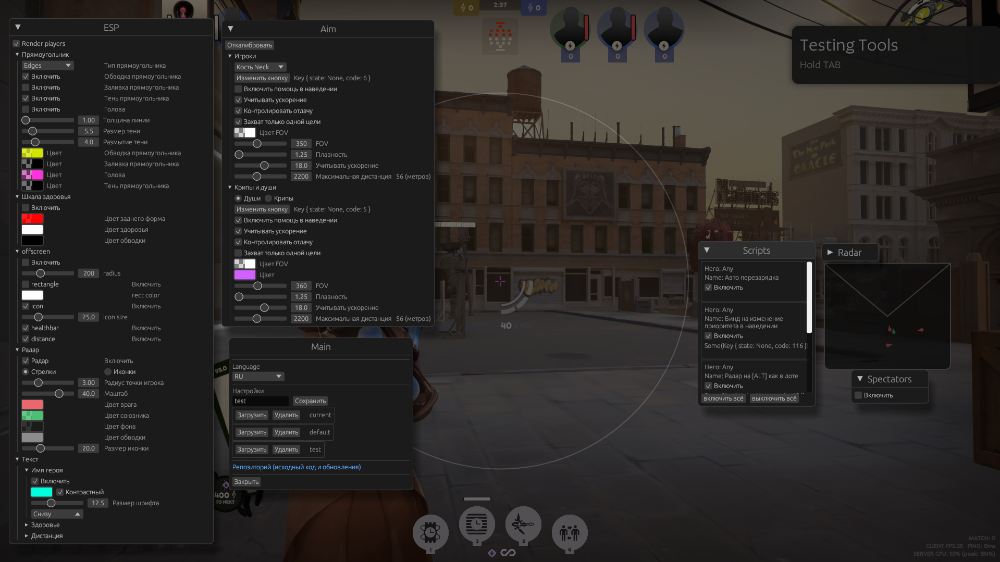
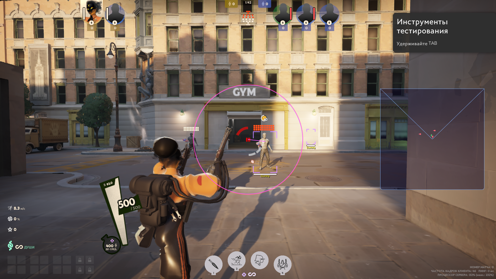

<h1 align="center">
      deadlock-esp
</h1>

<p align="center">
Добавьте этот репозиторий в избранное, чтобы не пропустить новые обновления.<br>
</p>

> [!WARNING]
> Использование чит-программ строго запрещено Габеном. Это может привести к блокировке вашего аккаунта!<br>
> Если вам не плевать на ваш аккаунт, то не используйте любые читы, включая этот <br>

> [!WARNING]
> The use of cheat programs is strictly prohibited by Gaben. This may result in your account being banned!<br>
> If you care about your account, then do not use any cheats, including this one

+ Аимбот
   - Цели
      - Игроки
         - Голова / Шея / Грудь / Таз
      - Души, крипы
      - Выбор приоритета
   - Учитывает скорость цели
   - Контроль отдачи (RCS)
   - Настраиваемый FOV
      - Дистанция
      - Цвет
   - Настрока для максимальной дистанции
+ Радар
   - Маштаб
   - Цвета
   - Размер, позиция
   - Направления игроков
   - Иконки игрока
+ ESP игроков
   - Боксы (прямоугольник игрока)
      - Тип обводки
         - Обычный
         - Закругленный
         - Углы
      - Обводка
      - Тень обводки
      - Настройка цветов и тени обводки
   - Голова
   - Шкала здоровья игрока (healthbar)
      - Иконки
      - Настройки цвета
      - Динамеческое изменение ширины
   - Надписи
      - Отображание:
         - Здоровье
         - Название героя
         - Дистанция в метрах
      - Расположение
      - Контрастность
      - Размер шрифта
+ Offscreen
   - Здоровье
   - Дистанция
   - Иконка
+ Файл конфигурации
   - Сохранение / Загрузка
+ Список наблюдателей
   - Показывает кто за вами смотрит
   - Показывает кто еще смотрит с вами
+ Локализация
   - Русский
   - Китайский
   - Английский (Hamburger edition)
+ Скрипты
   - Shiv - Скрипт для ульты. (Работает только с квикастами). Отображает низкий порог здоровья и приминяет ульт. (работает криво)
   - Active Reload - Скрипт для прожатия перезарядки в нужный момент, работает когда есть предмет "Активная перезарядка"
   - Переключение приоритета entity - При нажатии на <kbd>F5</kbd> меняет приоритет для наведения. Крипы / Души
   - RadarToggle - При зажатии клавиши <kbd>ALT</kbd>, на радаре отображаются иконки героев (как в доте)
   - Movement - При зажатии клавиши <kbd>CTRL</kbd>, с небольшим ускорением, герой прыгает в подкате, чтобы сохранить скорость. <kbd>G</kbd> - Dash

## Прочие мелочи
   - Цикл оверлея не работает, когда окно игры не активно
   - Не используется WriteProcessMemory
   - События мыши отсылаются из другого процесса
   - Авто обновление указателей из памяти модуля игры

## Как добавить свой скрипт

Используем этот интерфейс для написания своего скрипта. update - Логика, в которой мы пишем свой код. Она принимает внешние данные игры, текущее состояние клавиши и настройки конфига. Draw -  Отрисовка. Можем рисовать на экране и выводить уведомления.
hero_id возвращает героя, для которого будет работать скрипт. Если указать Hero::None, то скрипт будет работать на всех героях. Чтобы указать клавишу, которая будет использоваться при выполнении скрипта, используется метод init_key_code. Он используется только при инициализации скрипта, её нельзя будет сменить во время работы программы. Если ваш скрипт не требует использования клавиши, то возвращаем None. Клавиша указывается как i32, но для удобства можно использовать VirtualKeys.<br>

```rs
#[derive(Default)]
pub struct MyScript {...}
impl HeroScript for MyScript {
    fn update(&mut self, game_data: &External, script_key: KeyState, settings: &mut Settings) {...}
    fn draw(&mut self, g: &egui::Painter, game_data: &External, toasts: &mut Toasts) {...}
    fn hero_id(&self) { Hero::Vindicta }
    // Название, которое будет отображаться в UI
    fn name(&self) -> &str {"My script!"}
     // Клавиша. Если клавиша не нужна, то возвращаем None
    fn init_key_code(&self) -> Option<i32> { Some(VirtualKeys::KEY_F1 as i32) }
}
```

Далее переходим в конструктор оверлея и добавляем свой скрипт

> src>external>scripts>mid.rs>get_scripts() -> Vec<(Arc<Mutex<dyn HeroScript>>, HeroScriptSettings)>

```rs
pub fn get_scripts() -> Vec<(Arc<Mutex<dyn HeroScript>>, HeroScriptSettings)> {
    vec![
        (Arc::new(Mutex::new(MyScript::default())), HeroScriptSettings::default())
    ]
}
```

<hr>

## Запуск 

0. Устанавливаем [Rust](https://www.rust-lang.org/ru/learn/get-started) и [Cargo](https://doc.rust-lang.org/cargo/getting-started/installation.html)
1. Клонируем репозиторий
1. Меняем имя приложения в [toml файле](https://github.com/Loara228/deadlock-esp/blob/master/Cargo.toml)

```txt 
name = "{название программы}"
```

3. Компилируем проект:

```txt
cargo build --release
```

4. Запускаем игру
5. Запускаем чит

```txt
{название программы} --offsets
```

6. Для открытия/закрытия используется клавиша <kbd>HOME</kbd>

## Offsets

<div align="left">
<b>
      <a href="https://github.com/Loara228/deadlock-esp/blob/master/offsets/client_dll.cs">cs💜</a> | 
      <a href="https://github.com/Loara228/deadlock-esp/blob/master/offsets/client_dll.hpp">cpp💀</a> | 
      <a href="https://github.com/Loara228/deadlock-esp/blob/master/offsets/client_dll.rs">rs🦀</a>
      (больше не обновляю)
</b>
</div>

Актуальные смещения, которые используются в проекте - [тык](https://github.com/Loara228/deadlock-esp/blob/master/src/external/offsets/mod.rs)

## Превью







<div align = "center">

</div>

> <a href="https://www.youtube.com/watch?v=3nJs6GPmEZs"><sub><sub>💪старый бог💪</sup></sub></a>

