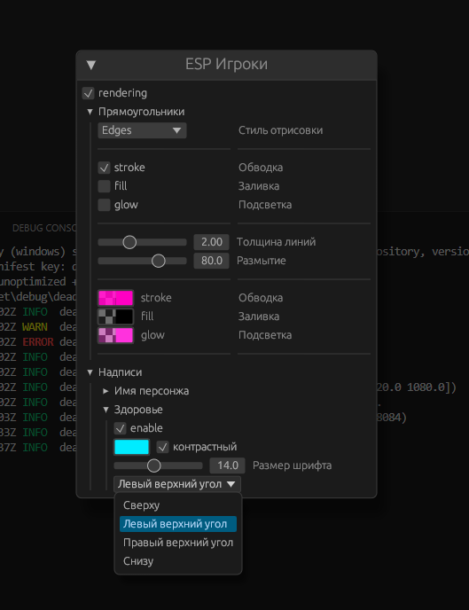
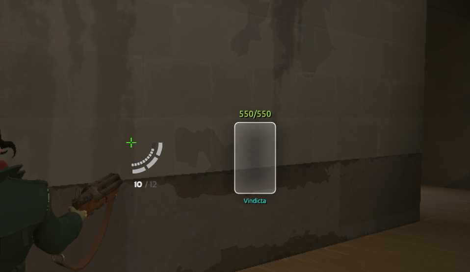

<h1 align="center">
      deadчпок-esp 
</h1>

# Использование

Для компиляции приложения вам понадобятся Rust и Cargo. Пожалуйста, убедитесь, что они установлены.

```cfg
rustc --version
rustc 1.76.0 (07dca489a 2024-02-04)
cargo --version
cargo 1.76.0 (c84b36747 2024-01-18)
```

# Запуск 

Для запуска требуется скомпилировать проект:
```txt
cargo build --release
```
или просто

```txt
cargo run
```

## Указатели

[rs](ссылка)
[csharp & cpp](ссылка)

## Превью







<hr>

<h4 align="center">⭐ Добавьте этот репозиторий в избранное, чтобы не пропустить новые обновления ⭐ </h4>

> Проект на данный момент всё еще развиваться и обдумывается новый функционал.
> ... но я пиздец ленивый

last video (это прошлый проект): https://www.youtube.com/watch?v=uOCpxAk8sOg