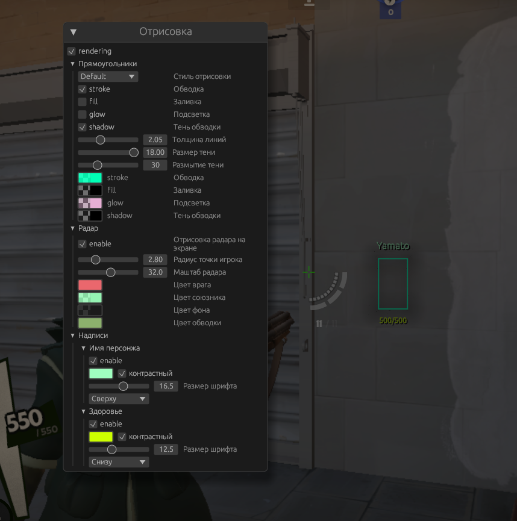
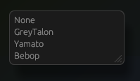
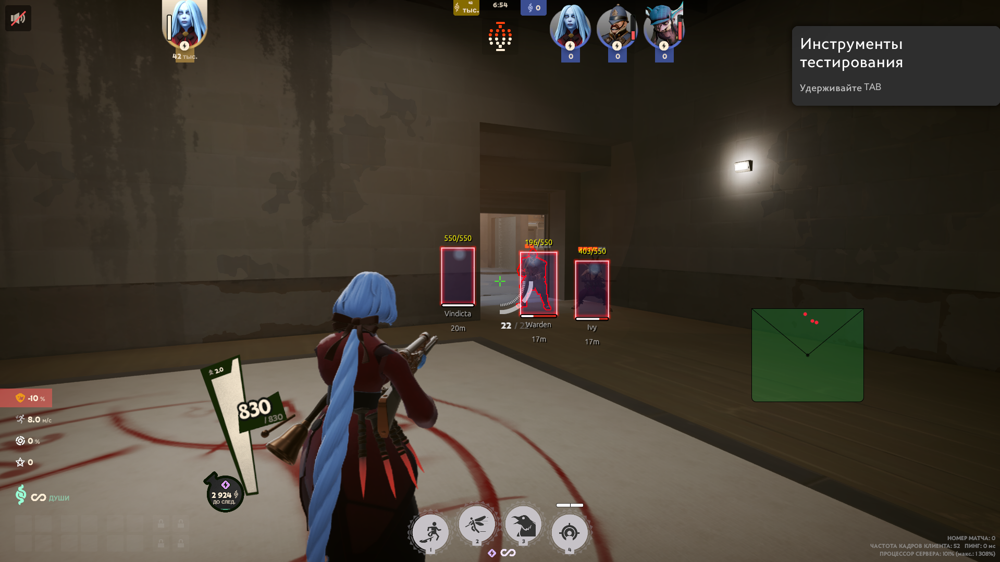
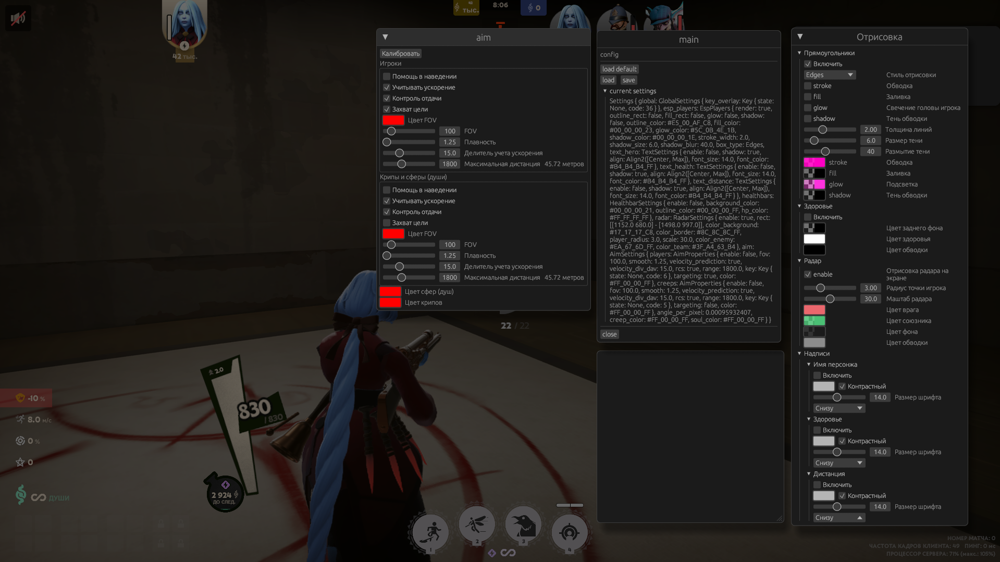
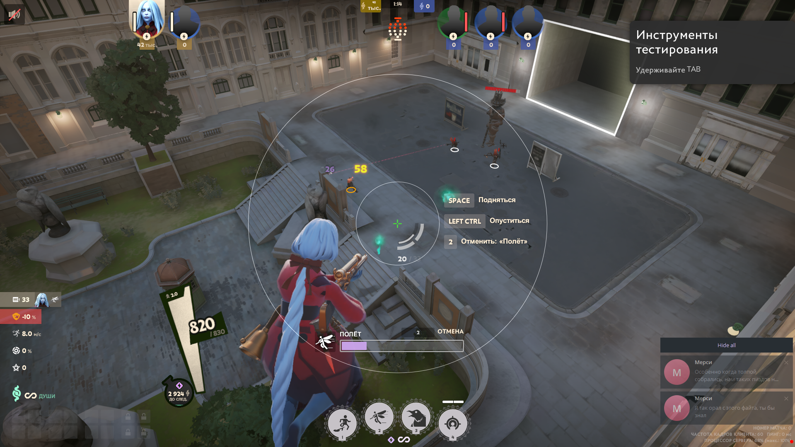
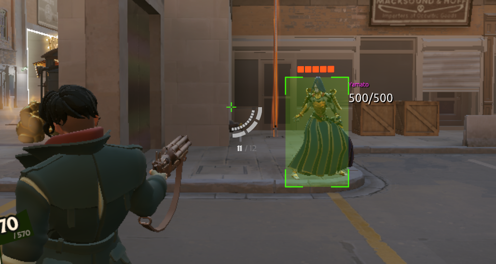

<h1 align="center">
      deadlock-esp
</h1>

<p align="center">
Добавьте этот репозиторий в избранное, чтобы не пропустить новые обновления.<br>
</p>

## Настройки

+ Аимбот
   - Цели
      - Игроки
      - Души, крипы
   - Учитывает скорость цели
   - Контроль отдачи (RCS)
   - Настраиваемый FOV
      - Дистанция
      - Цвет
   - Настрока для максимальной дистанции
+ Радар
   - Маштаб
   - Цвета
   - Размер, позиция
+ ESP игроков
   - Боксы (прямоугольник игрока)
      - Тип обводки
         - Обычный
         - Закругленный
         - Углы
      - Обводка
      - Тень обводки
      - Настройка цветов и тени обводки
   - Голова
   - Шкала здоровья игрока (healthbar)
   - Надписи
      - Отображание:
         - Здоровье
         - Название героя
         - Дистанция в метрах
      - Расположение
      - Контрастность
      - Размер шрифта
+ Файл конфигурации
   - Сохранение / Загрузка
+ Список наблюдателей
   - Показывает кто за вами смотрит
   - Показывает кто еще смотрит с вами

## Прочие мелочи
   - Цикл оверлея не работает, когда окно игры не активно
   - Не используется WriteProcessMemory
   - События мыши отсылаются из другого потока
   - Авто обновление указателей из памяти модуля игры
   - В коде есть GlobalVars и Abilities, но не используются. Можете сами что-то запилить


<hr>

# Запуск 

1. Компилируем проект:

```txt
cargo build --release
```

2. Далее запускаем игру
3. Запускаем чит
4. Для открытия/закрытия используется клавиша <kbd>HOME</kbd>

## Offsets

<div align="left">
<b>
      <a href="https://github.com/Loara228/deadlock-esp/blob/master/offsets/client_dll.cs">cs💜</a> | 
      <a href="https://github.com/Loara228/deadlock-esp/blob/master/offsets/client_dll.hpp">cpp💀</a> | 
      <a href="https://github.com/Loara228/deadlock-esp/blob/master/offsets/client_dll.rs">rs🦀</a>
</b>
</div>

## Превью













<div align = "center">

</div>

> <a href="https://www.youtube.com/watch?v=3nJs6GPmEZs"><sub><sub>💪старый бог💪</sup></sub></a>

